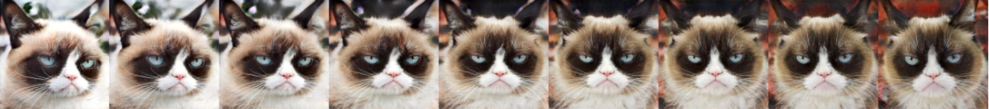

# Image to Image Translation Using GANs

## About 

This study explores two algorithmic methods that automatically synthesize new images of cats based on features learned from a training set of existing cat images.  

1. The first method uses deep Convolutional GAN (DCGAN) to replicate cat images in the style of the training set. Image augmentation is also explored as a method to stabilize the model and improve training accuracy and speed. 

2. The second method uses the CycleGAN algorithm to synthesize a new image that shares similar content of an existing image but appearing in a different style.  In this case, we explore a method to synthesize a new cat image that maintains the pose and content of an image of a gray cat (see “Part 2: CycleGAN” below) but created in the style of “grumpy cat”, as shown in image above.  

Cycle-Consistency loss is explored as a means of improving CycleGAN accuracy and speed. Though this exploration focuses on cat images, both DCGAN and CycleGAN can be applied to any image content, including images of architecture.  For example, CycleGAN can be used to transform a Frank Gehry building into the style of Zaha Hadid and vice versa, while DCGAN can create novel “designs” in any style.



<br>

## Project Page

An expanded description of this model implimentation can be found on its project page here:

```
www.michaelhasey.com/cyclegan
```

<br>

## Table of Contents

- [Dataset](#Dataset)
- [Approach](#Approach)
- [Implementation](#Implementation)
- [Performance](#Performance)
- [References](#References)
- [Citation](#Citation)

<br>

## Method 1 DCGAN

The DCGAN model architecture is made up of two major components.  The generator, which synthesizes new images based on learned features from the training set and the discriminator which attempts to determine whether this new image is real (an original image from the training set) or fake (a new image synthesized by training set).  As the model is trained, the generator tries to outsmart the discriminator by producing more accurate and realistic images in the style of the training set.  It does this by updating its learned weights which result from loss factors derived from this generator-discriminator competitive interaction.

<br>

### Step 1: Data Augmentation

DCGAN performs poorly without data augmentation on a small dataset because the discriminator can easily overfit to a real dataset. To fix this, we augment our data (ex. random crop and random horizontal flip) and add this to the training set, thus increasing the training sets size and diversity.


<br>

### Step 2: Constructing the Generator Model Architecture

Now, we will implement the generator of the DCGAN, which consists of a sequence of transpose convolutional layers that progressively upsample the input noise sample to generate a fake image. The generator in this DCGAN has the following architecture. [2]


<br>

### Step 3: Constructing the Discriminator Model Architecture

The discriminator  architecture is shown to the right.  It incorporates the original 3 channel rgb image on the left which is progressively downsampled and analyzed via a series of transpose convolutional layers.  The final and smallest layer (1x1x1) represents the final stage in the process where it determines whether the image it is analyzing is real or fake. 


<br>

### Step 4: Setting Model Hyper Parameters to Downsample & Upsample the Image

Within both the generator and discriminator model shown above, the original image is both downsampled and upsampled by a factor of two (ex. 64x64 -> 32x32).  In order to do this, padding must be set to 1, kernel size to 4x4, and stride to 2.  The appropriate padding amount can be determined by the following formula: Padding = ((S-1)*W-S+F)/2, with F = filter size, S = stride, W = width. So Padding = ((2-1)*8-2+4)/2.  Thus, Padding = 1.


<br>

### Step 5: Define the model training Loop

“Next, we will implement the training loop for the DCGAN. A DCGAN is simply a GAN with a specific type of generator and discriminator; thus, we train it in exactly the same way as a standard GAN.” [2]  The basic structure for the training procedure is shown below.


<br>

### Results

The following results illustrate the importance of data augmentation and setting a high epoch count when training a DCGAN model.  To begin, augmenting your data prior to training helps to achieve better results.  By augmenting the dataset (ex. flipping, rotating, stretching the original image), you both increase the size and variety of images in the dataset, thus allowing the model to learn a wider variety of image features, thus creating a more robust and higher performing model.  Finally, setting a higher epoch count (ex. 10,000 compared to 100) allows the model to train for a longer period of time and thus, identify, learn and recreate increasingly finer details and patterns found within the training set.


After 300 epochs, it is quite clear that the discriminator and generator losses are approaching convergence and stabilization.    Convergence implies that the GAN model found an optimum where large improvements (overall image shapes, composition, colour, etc) cannot be made anymore. Convergence is expressed in the accompanied loss graph (to right) when the D Loss and G loss converge and fluctuations are reduced.  This means that an ideal and consistence generator and discriminator loss has been achieved and adequate training has occurred. That being said however, smaller and finer improvements (textures, smaller features, image details, etc) can still be made with further training and model optimization.

<br>

## Method 2 CycleGAN

“In the second part, we will implement a more complex GAN architecture called CycleGAN for the task of image-to-image translation. We will train the CycleGAN to convert between different types of two kinds of cats (Grumpy and Russian Blue).” [2]


<br>

### Step 1: Construct the CycleGAN Model Architecture

“The generator in the CycleGAN has layers that implement three stages of computation: 1) the first stage encodes the input via a series of convolutional layers that extract the image features; 2) the second stage then transforms the features by passing them through one or more residual blocks; and 3) the third stage decodes the transformed features using a series of transposed convolutional layers, to build an output image of the same size as the input. The residual block used in the transformation stage consists of a convolutional layer, where the input is added to the output of the convolution. This is done so that the characteristics of the output image (e.g., the shapes of objects) do not differ too much from the input.” [2]


<br>

### Step 2: Implement the CycleGAN Training Loop

The CycleGAN training procedure is a bit more complex the standard “Vanilla” GAN training loop for the previous DCGAN . However, due to the symmetry in the training procedure (ex. all operations are done for both X → Y and Y → X directions), the implementation is not as challenging as initially expected.  Code for both the X → Y and Y → X directions are the same but with X variables replaced by Y variables and vice versa. Similarly, both DCGAN and CycleGAN implement similar least-square error loss function when determining generator and discriminator loss, updating weights, and overall model training.


<br>

### Step 3: Impliment Cycle-Consistency Loss to Improve Results

“The most interesting idea behind CycleGANs (and the one from which they get their name) is the idea of introducing a cycle consistency loss to constrain the model. The idea is that when we translate an image from domain \(X\) to domain \(Y\), and then translate the generated image back to domain \(X\), the result should look like the original image that we started with. The cycle consistency component of the loss is the mean squared error between the input images and their reconstructions obtained by passing through both generators in sequence (i.e., from domain \(X\) to \(Y\) viathe \(X \to Y\) generator, and then from domain \(Y\) back to \(X\) via the \(Y \to X\) generator). The cycle consistency loss for the \(Y \to X \to Y\) cycle is expressed as follows:” [2] As shown in the results below, implementing cycle-consistency loss into the CycleGAN greatly improves results.


<br>

### Results

The following results illustrate the importance of implimenting cycle-consistency loss within a CycleGAN model.  Though perhaps not as apparent after 600 iterations, cycle-consistency loss ensures that translated image (X -> Y) can be translated back to the original image (Y -> X).  If it does not, the model applies additional loss to help guide a seamlessly matching input and output image.  The result of this, is an output image that perfectly matches the content of the input, though with a different style.


A final approx. 6 hour training session that ran through 100,000 iterations was carried out.  Cycle-consistency loss was applied and the best results were achieved.

<br>

## References

[1] https://poloclub.github.io/cnn-explainer
[2] https://learning-image-synthesis.github.io/assignments/hw

This project was completed as part of Carnegie Melon University's Learning Based Image Synthesis course 16 726 taught by Jun-Yan Zhu in Spring of 2021.

<br>

## Citation

If you find this project useful in your research, please consider citing:

``` 
@misc{mhasey2021,
    title={Image to Image Translation Using GANS},
    author={Michael Hasey},
    year={2021},
}
```
